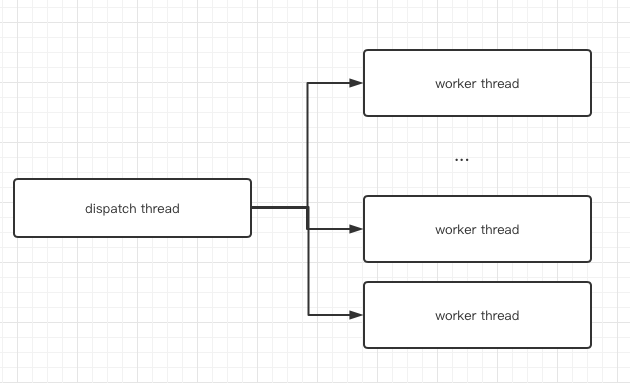
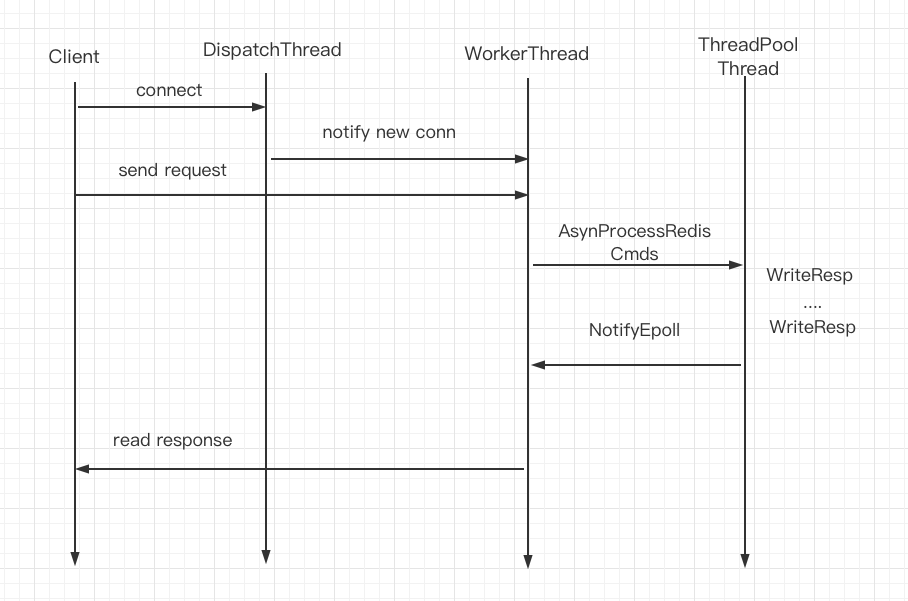

## Introduction

Pika是Qihoo360 开源的一款兼容redis协议的高性能kv存储服务，其与redis最大的不用点是其数据是基于磁盘而不是基于内存。同时使用了多线程的方式提高了读写效率。更多的整体设计和实践细节参见Wiki的设计实现板块。这里是更多做代码层面分析，适合想要从事Pika开发的同学。

Pika使用了同样是Qihoo360 开源的Pink 网络库，如果要了解pika的代码，首先要了解其网络库的网络模型，和调用关系，下面我们来看一下Pink的网络模型。

## 线程模型

一切从Thread 开始

```c++
class Thread {
  int Thread::StartThread() {
    return pthread_create(&thread_id_, nullptr, RunThread, (void *)this);
  }
  void* Thread::RunThread(void *arg) {
    // thread 的执行函数
    thread->ThreadMain()
  }
  virtual void *ThreadMain() = 0;
}
```

Tread 类只是对pthread 调用进行了一层封装，值得注意的是ThreadMain 是各线程的入口函数。

## ServerThread

```c++
class ServerThread : public Thread {
  const ServerHandle *handle_;
  
  void ServerThread::DoCronTask();
  void ServerThread::ProcessNotifyEvents(const PinkFiredEvent* pfe);
  virtual void HandleConnEvent(PinkFiredEvent *pfe) = 0;
  virtual void HandleNewConn(int connfd, const std::string& ip_port) = 0;
  
  void *ServerThread::ThreadMain() {
    while (!should_stop()) {
      DoCronTask();
      // epoll_wait
      nfds = pink_epoll_->PinkPoll(timeout);
      for (int i = 0; i < nfds; i++) {
        if (pfe->fd == pink_epoll_->notify_receive_fd()) {
          ProcessNotifyEvents(pfe);
          continue;
        }
        if (/*is listening fd*/) {
          connfd = accept(fd, (struct sockaddr *) &cliaddr, &clilen);
          handle_->AccessHandle(ip_port);
          /*
           * Handle new connection,
           * implemented in derived class
           */
          HandleNewConn(connfd, ip_port);
        } else {
          /*
           * Handle connection's event
           * implemented in derived class
           */
          HandleConnEvent(pfe);
        }
      }
    }
  } 
}
```

ServerThread类主要提供一个server的框架，也是一个虚类，衍生类需要实现HandleConnEvent HandleNewConn 等函数。

1，其中ServerHandle 是各种事件发生之后的回调函数，这个类由使用者实现并传入serverthread，各类事件（例如链接关闭）发生时，serverthread 会调用相应的回调函数通知serverthread 的使用者。ServerHandle包含的函数有处理连接超时的FdTimeoutHandle，处理连接被关闭的FdClosedHandle 等等。

```c++
class ServerHandle {
  virtual void FdTimeoutHandle(int fd, const std::string& ip_port) const {
    UNUSED(fd);
    UNUSED(ip_port);
  }
  virtual void FdClosedHandle(int fd, const std::string& ip_port) const {
    UNUSED(fd);
    UNUSED(ip_port);
  }
  ...
}
```

2，ProcessNotifyEvents 函数主要是serverthread处理异步通信用的，其他线程可以通过写入PinkEpoll 的notify_send_fd（具体的消息内容存到了notify_queue里面），在下一次serverthread epoll 循环的时候就可以通过notify_receive_fd读到有消息要处理，从notify_queue读出消息，处理其他线程的事件。

```c++
class PinkEpoll {
  // fds is pipe
  notify_receive_fd_ = fds[0];
  notify_send_fd_ = fds[1];
  std::queue<PinkItem> notify_queue_;
}
```

### DispatchThread

DispatchThread维护一组worker thread，worker thread 用来处理客户端连接的读写，DispatchThread主要负责accept 客户端socket连接，然后通过worker线程的pink_epoll 通知worker线程。DispatchThread继承于ServerThread只是实现了HandleNewConn 用于处理新连接。



```c++
class DispatchThread : public ServerThread {
  void DispatchThread::HandleNewConn() {
    // schedule this conn to one of worker
    PinkItem ti(connfd, ip_port, kNotiConnect);
    std::queue<PinkItem> *q
      = &(worker_thread_[next_thread]->pink_epoll()->notify_queue_);
    q->push(ti);
  }
}

// 其本质是一个 server 线程的缩写版本 只处理conn 的读写
class WorkerThread : public Thread {
  // pink_epoll 为了Dispatch 线程accept 之后可以通知给worker线程
  PinkEpoll *pink_epoll_;
  void *WorkerThread::ThreadMain() {
    while(!should_stop) {
      nfds = pink_epoll_->PinkPoll(timeout);
      for (int i = 0; i < nfds; i++) {
        if (pfe->fd == pink_epoll_->notify_receive_fd()) {
          if (ti.notify_type() == kNotiConnect) {
            // 将accept 的fd 收入到自己的conn结构里面，之后负责这个conn的读写
            std::shared_ptr<PinkConn> tc = conn_factory_->NewPinkConn(
              ti.fd(), ti.ip_port(),
              server_thread_, private_data_, pink_epoll_);
          } else if (ti.notify_type() == kNotiEpollout) {
            pink_epoll_->PinkModEvent(ti.fd(), 0, EPOLLOUT);
          } else if (....) {
            ....
          }
        } else {
          if ((pfe->mask & EPOLLOUT) && in_conn->is_reply()) {
            WriteStatus write_status = in_conn->SendReply();
            ...
          }
          if (!should_close && (pfe->mask & EPOLLIN)) {
            ReadStatus read_status = in_conn->GetRequest();
						...
          }
        }
      }
    }
  }
}
```

1，新建客户端连接时候Dispatch Thread调用HandleNewConn 向worker thread 传入fd消息，worker thread 负责调用conn_factory 中的NewPinkConn方法，按照使用者的实现方式新建一个connection负责后续的数据读写。

ConnFactory 是一个工厂类，用于创建连接，DispatchThread 的使用者必须自己实现其ConnFactory::NewPinkConn 函数。

```c++


/*
 * for every conn, we need create a corresponding ConnFactory
 */
class ConnFactory {
 public:
  virtual ~ConnFactory() {}
  virtual std::shared_ptr<PinkConn> NewPinkConn(
    int connfd,
    const std::string &ip_port,
    Thread *thread,
    void* worker_private_data, /* Has set in ThreadEnvHandle */
    PinkEpoll* pink_epoll = nullptr) const = 0;
};
```

2，后续通过调用不同connection实现的SendReply 和GetRequest 进行读写操作。

### Connection

PinkConn类是对客户端连接的抽象，控制客户端数据的读取，解析，以及结果的缓存，写回。不同协议的connection回有相应的自己实现，这里以RedisConn为例。

```c++
class PinkConn : public std::enable_shared_from_this<PinkConn> {
  virtual ReadStatus GetRequest() = 0;
  virtual WriteStatus SendReply() = 0;
  int fd_;
  std::string ip_port_;
  bool is_reply_;
  struct timeval last_interaction_;
  int flags_;
}
```

PinkConn 当中包含了GetRequest SendReply两个纯虚函数，控制数据如何读取和写回。

```c++
class RedisConn: public PinkConn {
  RedisConn(const int fd,
            const std::string& ip_port,
            ...
            const HandleType& handle_type = kSynchronous,
            const int rbuf_max_len = REDIS_MAX_MESSAGE);
  // serverthread 或者 worker thread 调用
  virtual ReadStatus GetRequest() {
    // read from socket
    // forward to redis_parser_, redis_parser will invoke callback
    // when one command is completely parsed
    redis_parser_.ProcessInputBuffer();
  }
  virtual WriteStatus SendReply() {
    // write response back
    while() {
      nwritten = write(fd(), response_.data() + wbuf_pos_,
          wbuf_len - wbuf_pos_);
    }
  }
  
  // RedisConn 使用者调用
  int RedisConn::WriteResp(const std::string& resp) {
    response_.append(resp);
    set_is_reply(true);
    return 0;
  }
  // kAsynchronous 调用接口
  virtual void AsynProcessRedisCmds(
      const std::vector<RedisCmdArgsType>& argvs, std::string* response);
  void NotifyEpoll(bool success) {
    // write to server thread or worker thread(conn holder) notify_send_fd
    // if success true tell conn holder set fd kEpolloutAndEpollin
    // if success false close conn holder this conn
  }  
  //kSynchronous 调用接口
  virtual int DealMessage(
      const RedisCmdArgsType& argv, std::string* response) = 0;
  
  RedisParser redis_parser_;
  std::string response_;
}

RedisConn::RedisConn() {
  // 初始化 将redis conn的ParserDealMessageCb ParserCompleteCb挂载到
  // redis parser中，redis parser 解析出完整的一条redis 命令会调用相
  // 应的ParserDealMessageCb 或者ParserCompleteCb 函数
  RedisParserSettings settings;
  settings.DealMessage = ParserDealMessageCb;
  settings.Complete = ParserCompleteCb;
}

// 根据具体的RedisConn 的配置是否为异步模式 调用RedisConn的DealMessage
// 函数或者AsynProcessRedisCmds
int RedisConn::ParserDealMessageCb(
    RedisParser* parser, const RedisCmdArgsType& argv) {
  RedisConn* conn = reinterpret_cast<RedisConn*>(parser->data);
  if (conn->GetHandleType() == HandleType::kSynchronous) {
    return conn->DealMessage(argv, &(conn->response_));
  } else {
    return 0;
  }
}
int RedisConn::ParserCompleteCb(
    RedisParser* parser, const std::vector<RedisCmdArgsType>& argvs) {
  RedisConn* conn = reinterpret_cast<RedisConn*>(parser->data);
  if (conn->GetHandleType() == HandleType::kAsynchronous) {
    conn->AsynProcessRedisCmds(argvs, &(conn->response_));
  }
  return 0;
}
```

RedisConn 中的redis_parser 结构用于解析redis 命令，每当解析完一条完整的redis 命令后回调相应的回调函数。

1，GetRequest 函数会不停的从socket读数据，放入redis_parser解析。redis_parser根据解析情况在合适的时候调用其DealMessage Complete回调。

2，SendReply 函数，会在合适的时机调用write 将response 缓存的返回数据写向客户端。

使用者需要继承RedisConn 实现类似MyRedisConn 的类，并且在其内部实现 DealMessage 函数或者AsynProcessRedisCmds。取决于当前使用的Conn的模式。

kAsynchronous模式下AsynProcessRedisCmds 的实现通常把解析好的Cmd 交付给另外的线程处理，例如T1，T1在处理完命令之后，调用WriteResp接口将结果写入RedisConn，再调用NotifyEpoll 将这个RedisConn 的EPOLLOUT监听打开，serverthread 或者worker thread的下一个epoll 循环 可以将结果写回。

kSynchronous 模式下DealMessage 的实现通常会直接处理命令调用WriteResp，返回worker thread 的ThreadMain 函数之后，在下一个epoll循环将结果写回。

## Pika 线程模型以及Cmd处理顺序

Pika 的PikaDispatchThread 是DispatchThread 的定制实现，PikaClientConn是RedisConn 的定制实现。


```c++
class PikaDispatchThread {
  class ClientConnFactory : public pink::ConnFactory {
    virtual std::shared_ptr<pink::PinkConn> NewPinkConn() {
      return std::static_pointer_cast<pink::PinkConn>
        (std::make_shared<PikaClientConn>())
    }
  }
  class Handles : public pink::ServerHandle {}
}

class PikaClientConn: public pink::RedisConn {
  void AsynProcessRedisCmds(
      const std::vector<pink::RedisCmdArgsType>& argvs,
      std::string* response) override;
};
void PikaClientConn::AsynProcessRedisCmds() {
  // schedule to thread pool
  g_pika_server->ScheduleClientPool(&DoBackgroundTask, arg);
}
// thread pool thead start processing cmd
void PikaClientConn::DoBackgroundTask(void* arg) {
  if (error) {
    // close conn
    conn_ptr->NotifyEpoll(false);
  }
  conn_ptr->BatchExecRedisCmd(bg_arg->redis_cmds);
}
void PikaClientConn::BatchExecRedisCmd(
    const std::vector<pink::RedisCmdArgsType>& argvs) {
  // process cmd...
  TryWriteResp();
}
void PikaClientConn::TryWriteResp() {
  // write response to local resp
  ...
  // notify worker thread open fd EPOLLOUT and ready to write back
  NotifyEpoll(true);
}
```



1，新的客户端连接接入到DispatchThread，DispatchThread accept 并生成fd，传递到worker thread。

2，worker thread 调用ClientConnFactory 的NewPinkConn 生成PikaClientConn，从此维护此PikaClientConn的读写行为。

3，worker thread调用GetRequest读取客户端请求放入redis_parser 进行解析，redis_parser 调用PikaClientConn::AsynProcessRedisCmds实现。将此cmd 放入thread pool queue。

4，thread pool thread 处理cmd，调用PikaClientConn::WriteResp将处理结果写入PikaClientConn的resp 结构，调用PikaClientConn::NotifyEpoll 通知worker thread 可以返回客户端。

5，worker thread 接收kNotiEpollout事件，打开这个conn fd 的EPOLLOUT ，下一个epoll_wait 周期检测到这个conn可写，调用WriteResp将resp的内容返回给客户端。

## Reference

https://github.com/Qihoo360/pika/tree/v3.3.4
https://github.com/Qihoo360/pink