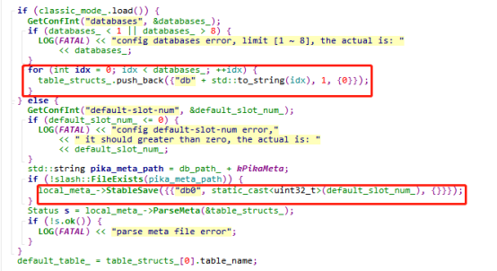
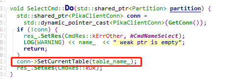
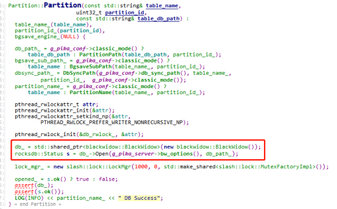
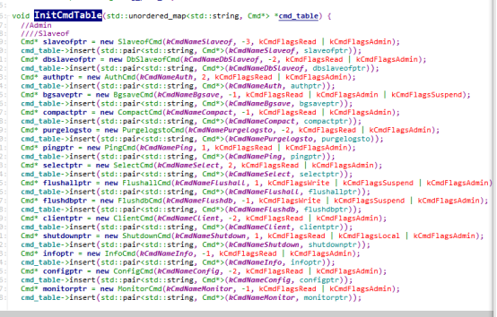

今天我们一起来看下pika收到一个命令后，是怎么处理这个命令的。
Pika现在支持了两种模式：一种是classic，一种是sharding。如果是使用classic模式，则pika支持多db，可以使用databases来配置db的个数；如果是使用sharding模式，则使用default-slot-num来配置该shard负责处理的slot的数量。

1.db，table，partition的关系

PikaServer启动的时候，会先初始化表结构，初始的表结构是由配置文件决定的

加载配置文件的入口是PikaConf::Load，根据配置文件，如果配置的是classic模式，则用databases来初始化table_struct，有多少个db，则有初始化多少个table；如果配置的是sharding模式，则获取solt的数量，初始化db0。可以看到，如果是classic模式，则一个db对应一个table，并且这个table只有一个分区partition，如果是sharding模式，则默认只有一个db，即db0，一个slot对应一个partition。

默认使用的表是第一个表，可以使用select dbid来选择是哪个表，SelectCmd会修改使用的表。

PikaServer::InitTableStruct中，会根据生成表结构信息来生成table，并且给这个table创建分区。

在Table::AddPartitions中，为每个分区创建了一个Partition，一个Partition对应着一个Blackwidow，Blackwidow一个基于rocksdb的封装的存储引擎，我们先直接认为他就是rocksdb，创建Partition会打开rocksdb，给后续的操作使用。

2.命令的执行流程
在了解命令的执行流程之前还需要了解下命令表CmdTable的初始化。Main函数里面启动pikaServer之前会先进行CmdTable的初始化

入口是InitCmdTable，我们可以看一下这个函数：

这个函数创建了各种命令对象，然后往CmdTable里面insert，CmdTable是一个map，key是命令的字符串，value就是具体的Cmd对象。所有的Cmd对象都继承了基类Cmd，真正执行命令的是各个Cmd的do方法。下面我们以set命令为例来说明这些命令是怎么执行的，在《Pika源码学习--pika的通信和线程模型》中我们已经知道了请求是怎么走的，并且知道最后是用了PikaClientConn::DoCmd这个函数来执行命令，今天我们具体看看这个DoCmd里面做了啥。

前面解析请求的时候已经知道了需要执行的是哪个命令，这里先根据命令的名称在CmdTable里面找到具体处理命令的对象，比如Set命令，就会找到SetCmd对象。找到命令后，会先执行cmd的初始化，做一些校验等工作，这里current_table_默认是使用默认表

然后调用Cmd::Execute，这里根据不同的命令会走不同的分支，是和命令的类型或者属性有关的，命令属性在初始化CmdTable的时候会初始化

我们以ProcessSinglePartitionCmd为例，处理命令的时候需要先找到Partition，如果是classic模式，一个table只有一个分区，如果是sharding模式，则根据命令的key来决定

需要具体的命令实现自己的current_key方法

Get partiton会根据key或者table_name，使用具体的数据分布算法得到处理的分区

找到分区后，就会调用具体命令对象的do方法来处理。partiton里面的db，就是前面说到的Blackwidow（rocksdb）存储引擎。

简单总结一下，执行一个命令的时候，先需要知道是哪个table的，然后根据命令名称在CmdTable里面获取处理命令的对象，然后找到处理具体这个命令的partiton，然后使用Blackwidow引擎来处理命令。